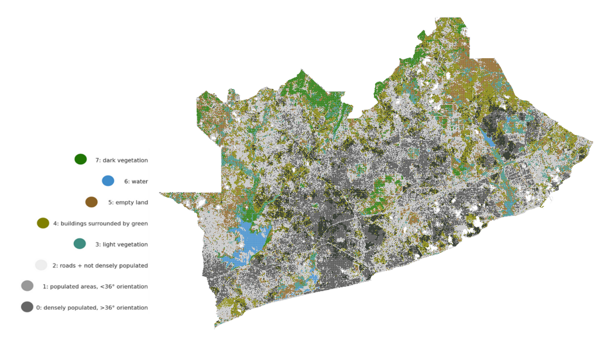

# Clusters of Accra

Scroll through this page to discover different clusters of Accra. Each map includes one or a set of clusters that describe the built environment, the natural environment or a mix of the two. The clusters are created with satellite imagery and an unsupervised computer vision algorithm that groups visually similar areas together.

*Eight different clusters plotted on top of a map of the Greater Accra Metropolitan Area (GAMA)*

How to use the interactive maps:
- Click the +/- buttons or scroll to zoom in and out.
- Click the top left icon to view the legend that describes the different colours on the map.
- Click the top right icon to open the map in a new tab.

Let me know if you can spot certain neighbourhoods within the clusters and if they make sense to you.
I'm especially interested in the following questions:

### Why do you think these clusters emerge?
* Are they influenced by geography (e.g. elevation, soil, etc.)
* Are they influenced by human action (e.g. areas of trade or transport, etc.)
* Are they influenced by historical planning (e.g. colonial city planning, etc.)

### What do they mean for humans living in these areas?
* What are the implications of living in a certain 'cluster'?
* What is the impact of location? (Inner/ outer Accra?)
* Is living in a certain cluster good/ bad for wellbeing and health?
* What changes could they bring in the future?

  

## Densely populated areas

Cluster specific questions:
- Are there any differences between the two dark grey clusters?
- What are the implications of living in these areas?

  

<iframe src="https://www.google.com/maps/d/u/0/embed?mid=1Sil1xH_RSBqN9GSPbgR3-yFW6rNJU2rR" width="640" height="480"></iframe>

  
### Let me know your thoughts

<form
  action="https://formspree.io/f/mayvwevj"
  method="POST">
  <label>
    Name:
    <input type="text" name="name" id="full-name" placeholder="First and Last" required="">
  </label>
    
  <label>
   
<textarea rows="8" cols="80" name="message" id="message" placeholder="Enter message here" required=""></textarea>

  </label>
  <!-- your other form fields go here -->
  <button type="submit">Send</button>
</form>
  

## Natural environments

Specific questions regarding the brown 'empty land' cluster:
- What are advantages/disadvantages of living in areas that are close to rubble/sandy ground?
- Will the city most like expand into these areas?
- Are these areas related to mining activities (in the past or present)?

  

<iframe src="https://www.google.com/maps/d/u/0/embed?mid=1Pl2iYoClOaY8aevwqg3i1NolVlaXqFkY" width="640" height="480"></iframe>
  

### Let me know your thoughts

<form
  action="https://formspree.io/f/mayvwevj"
  method="POST">
  <label>
    Name:
    <input type="text" name="name" id="full-name" placeholder="First and Last" required="">
  </label>
    
  <label>
   
<textarea rows="8" cols="80" name="message" id="message" placeholder="Enter message here" required=""></textarea>

  </label>
  <!-- your other form fields go here -->
  <button type="submit">Send</button>
</form>
  

## Mixed environments (Buildings surrounded by Vegetation)

Cluster specific questions:
- Can you spot any specific neighbourhoods within this cluster?
- What different types of areas does this cluster capture (e.g. farmland, wealthy neighbourhoods, etc.)?
  

<iframe src="https://www.google.com/maps/d/u/0/embed?mid=1F9ZGhvCr8qHo0VH8Z4pupH67jBvBkkbb" width="640" height="480"></iframe>

  

### Let me know your thoughts

<form
  action="https://formspree.io/f/mayvwevj"
  method="POST">
  <label>
    Name:
    <input type="text" name="name" id="full-name" placeholder="First and Last" required="">
  </label>
    
  <label>
   
<textarea rows="8" cols="80" name="message" id="message" placeholder="Enter message here" required=""></textarea>

  </label>
  <!-- your other form fields go here -->
  <button type="submit">Send</button>
</form>
  
or email me: antje.metzler18@imperial.ac.uk
  
## Thank you for participating!
